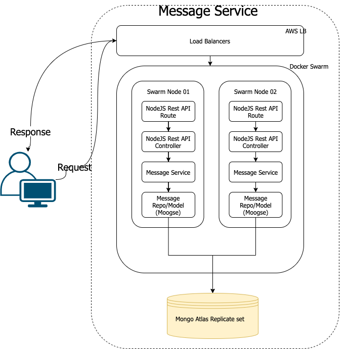

# Cloud Audition Project

## Description

- This application manages messages, provides details about those messages, and determines whether a
  message is a palindrome.
- The system is deployed on Amazon and using AWS Application Load Balancer to manage network traffic
  to docker swarm nodes.
- Chosen Node as REST API server and use Mongo Atlas as data storage.
- Application tested in node version 12, 14, 15 by GitHub actions.
- Project API is designed to follow Rest Design Pattern. [See API Doc](API.md).

## Architecture



## Before using on local env

- NodeJS 12+
- MongoDB installed and running locally
- Run `npm install` or `yarn` in your root project folder

## Start Application

edit package.json `start` script `MONGO_DB_URI` to point to your local MongoDB environment

    npm install
    npm run start //start application at localhost:3000

## Use Docker for local development

**Before start containers in local env**

- Docker 18+
- port port 3000 is in use

**start containers**

```
//enviroment read from .env.dev
//start application at localhost:3000
//use override entry ponint npm run start:container
docker-compose up -d 
```

## API Doc

[API Doc](API.md)

### Unit Test

    npm run test:unit

[Unit Test Result](docs/images/command-line-test-result.md)

### Integrated
```
//enviroment read from .env.dev
//start application at localhost:3000
//use override entry ponint npm run test:integrated
docker-compose -f docker-compose-integrated-test.yml up 
```
    

[integrated Test Result](docs/images/command-line-test-result-2.md)

### GitHub Action Unit Test Report

[Unit Test Result](https://github.com/GoodSpeed-HL/message-service/runs/2315423072?check_suite_focus=true)

### Issues 

👮🏾‍♂️👮‍♀️
palindromic currently set to true

### Find unexpected response? use debug env to log detailed log, e.g. MongoDB query and API server error trace

```bash
# DEBUG=message-service:* ...other_env_vars npm run start
```
